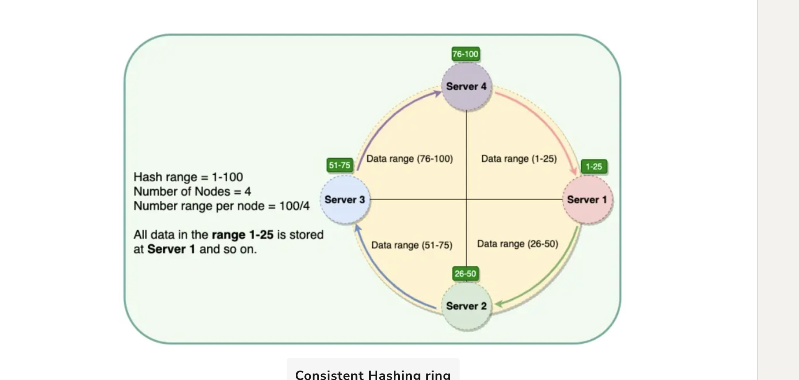
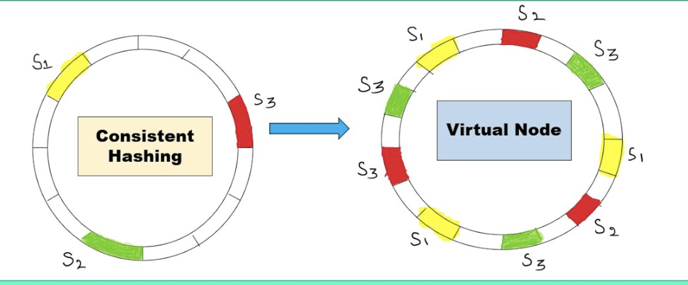

used in Data partitioning.

With data partitioning a problem occurred which is the from which partition should we read or to which partition should we write.

Imagine this we want to have a fixed size of dbs in which we want to have same tables but different data to increase performance.

Lets think this we want to save id 100, where should we put this ? here's where a simple formula comes to rescue.

a simple formula for a 4 DBs would be to hash the id 100 and take the modulos of 4

hash(100) % 4 = WHICH_DB 

so this is for a fixed size of partitions. But what happens if the size of our partitions change each time, from 4 to 3 or to 5

then our formula for fixed size now will break and there will be an outage of data finding.

This is where CONSISTENT HASHING comes into rescue

in Consistent hashing we have a ring like in the image and we say basically we will store data from 

X to Y in DB1
Z to W in DB2
A to B in DB3
C to D in DB4

this way we will always insert data in some correct db and read from correct DB

but here there is a problem with db removal, if we remove one(like DB4) in the ring algorithm the whole data from DB4 will go into DB1
which will make DB1 overwhelmed and overfilled.

There are Virtual Nodes we can use instead of fixed size per db

with Virtual consistent hashing we can set db emplacement to different sizes each time and whenever a db is removed we can simply migrate data of
that db to the next one clock wise, and this way we will share data equally to others dbs as well.

