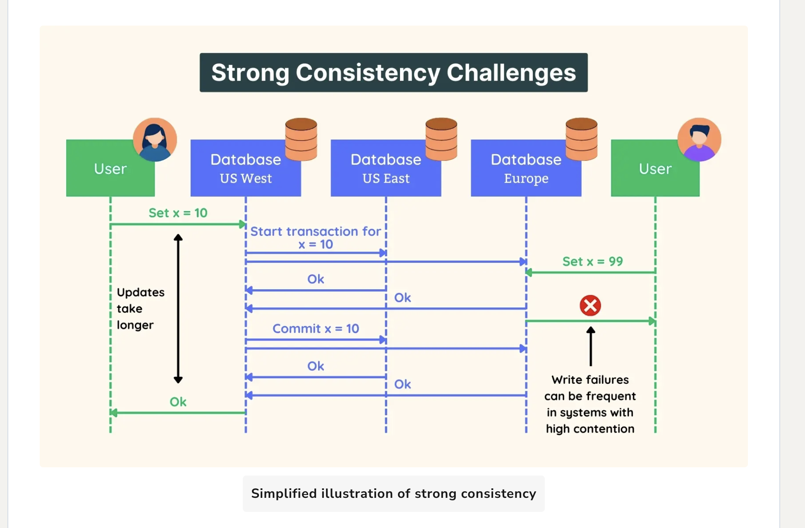
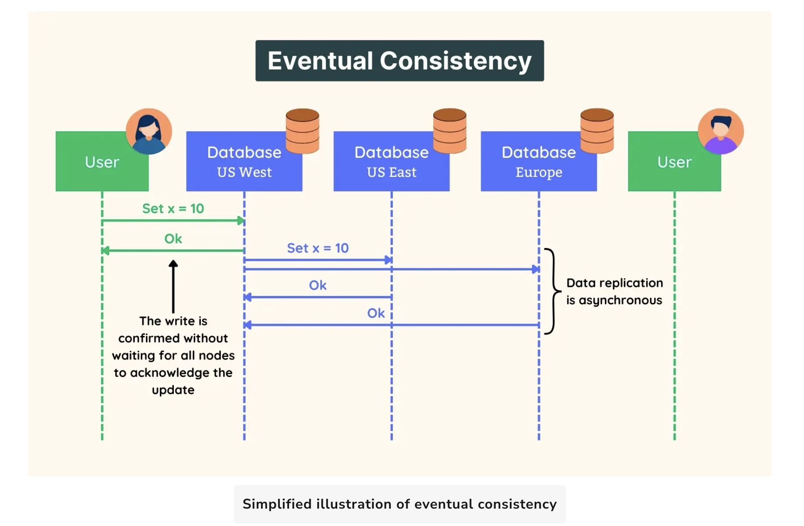

In distributed systems consistency is handled in two ways.

In large scale systems, under heavy traffic we prefer our data to also be partitioned or be easily reachable in different Zones. This brings a complex question about data, 

What happens if one of our zone our data node got update and what happens for other nodes or zones ? 

## Strong Consistency
Under strong consistency we basically say if one of our node got an update our other nodes should also be updated, unless all nodes have same data we dont say the operation is successful. 
Let's think of this example in a banking system if one user did a withdrawal all other ATMs or Banking branches should also give the same information of the latest update, otherwise we will give information
that is not correct and this might cause duplicate operations in such systems.

So In strong consistency we usually prefer not being available, performant but consistent on each operation if any operation is executed we want all our nodes reflect the same latest state on that operation.

- An operation X is done and one of our node is not available or we have some network issue then we count this operation not successful because better to be consistent than available in a system like finance.

## Eventual Consistency
Under eventual consistency if one node(quorum is used to determine the number of nodes) got the update then we say this operation is successful and we return OK the user, but the system will keep updating other nodes in the background.
We prefer being available then consistent right away.

In a system like social media, it is important that you are able to post something right away or like something but it is less important for another user to see you liked or you posted we can tolerate some timeout on that operation

